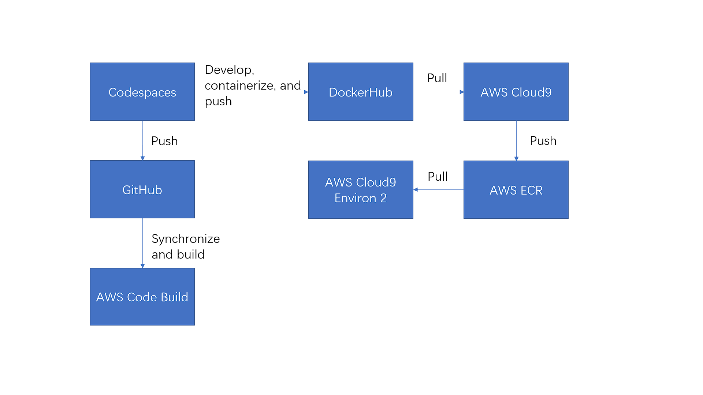
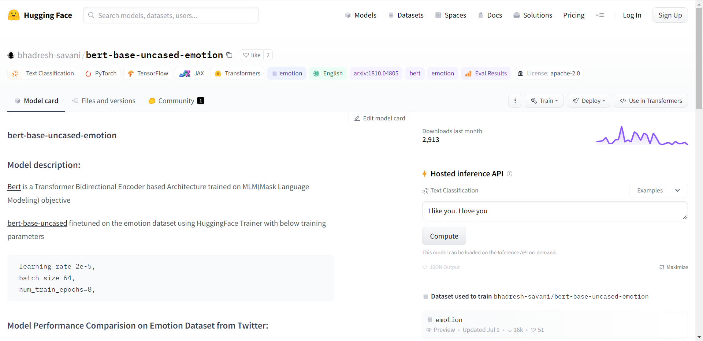

## Introduction

This project utilizes bash command line tools, pre-trained neuron network model, Docker, GitHub Codespaces and Action, and AWS Cloud technology to realize the process from the development to the deployment of a sentiment analysis system.

The project first uses a pre-trained model to develop a sentiment analysis system on GitHub Codespaces. Then, a bash command line tool is developed to provide access to the system. Next, the system as well as the command line tool are containerized to a docker image and pushed to the Docker Hub. After that, the docker image is pulled to an AWS Cloud9 virtual machine, pushed to an ECR private repository, and pulled to another AWS Cloud9 virtual machine for deployment. In the meanwhile, the GitHub repository is pre-built by GitHub Action as well as AWS Code Build for further usage.

The diagram of the workflow is shown below.

## Model

The model used in this project is pre-trained model ([bhadresh-savani/bert-base-uncased-emotion](https://huggingface.co/bhadresh-savani/bert-base-uncased-emotion/commit/7aae928255cef4d964f6623ba6631eff7c360634)) from hugging-face.

## Data

Since the model is pre-trained, this project didn't use any dataset to train the model. The data for demonstration is manually created.

## Usage

This project provides two methods to access the system:

- Web UI
- Bash Command Line

There are also two ways to use this project:

- By Code
- By Docker

### By Code

- Clone the repository from GitHub

  `git clone https://github.com/nogibjj/IDS706-Project-2`

- Use Web UI

  - `cd <project directory>`
  - `python interface.py`
  - Use the local host with port 7860 or the URL provided in the command line to access the system in the browser
  - You can use the text box to do the sentiment analysis

- Use Command Line Tool

  - `cd <project directory>`
  - `bash batch_sent.sh <input.txt> <output.txt>`
  - `<input.txt>`should contain the sentence in English for sentiment analysis
  - `<output.txt>` is the file for the result of the sentiment analysis

### By Docker

- Use Web UI

  - `docker pull shunianchen/ids706:webui`
  - `docker run --rm -it shunianchen/ids706:webui`
  - Follow the same step as specified in By Code

- Use Code

  - `docker pull shunianchen/ids706:inference`
  - `docker run --rm -it shunianchen/ids706:inference`

  

